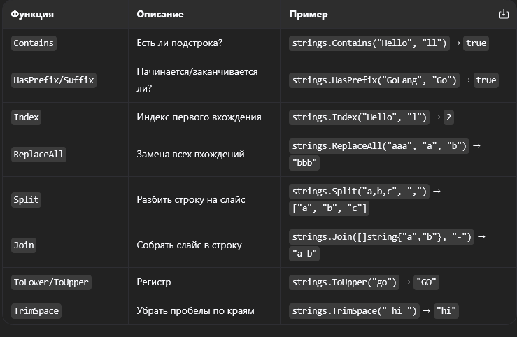

# Тема 32: Строки, байты и руны

## 1. Строка как срез байтов
В Go строка — это неизменяемая последовательность байтов.
`len(s)` возвращает количество байт, а не символов.

## 2. UTF-8 и Руны
*   Латиница: 1 байт.
*   Кириллица: 2 байта.
*   Эмодзи: 4 байта.
*   `rune` (alias for `int32`) — один Unicode-символ.

## 3. Индексация
`s[0]` возвращает **байт** (число), а не символ.
Для работы с символами: `[]rune(s)[0]`.

## 4. Пакет `strings`
*   `Contains(s, sub)` — поиск подстроки.
*   `ReplaceAll(s, old, new)` — замена.
*   `Split(s, sep)` / `Join(sl, sep)` — разбор и сборка.

## 5. Неизменяемость
`s[0] = 'A'` вызовет ошибку компиляции. Изменение строки всегда создает новую строку в памяти.

В Go строки устроены не так, как во многих других языках. Понимание разницы между байтами и символами (рунами) критически важно для работы с текстом, особенно если в проекте есть поддержка разных языков или эмодзи.

1. Внутреннее устройство строки
Строка в Go (string) — это неизменяемый (immutable) срез байтов.

    Неизменяемость: Ты не можешь изменить часть строки по индексу (s[0] = 'A' вызовет ошибку компиляции).
    Память: При изменении строки (например, через конкатенацию +) всегда создается новая копия в памяти.

2. Кодировка UTF-8

Go «из коробки» работает с UTF-8. Это значит, что длина строки в байтах не всегда равна количеству видимых символов.

    ASCII (латиница, цифры): 1 байт на символ.
    Кириллица, европейские языки: 2 байта на символ.
    Азиатские иероглифы, эмодзи: 3–4 байта на символ.

s := "Go"
fmt.Println(len(s)) // 2

s2 := "Я"
fmt.Println(len(s2)) // 2 (байта), хотя символ один

3. Руны (rune)

Тип rune — это алиас для int32. Он представляет собой одну кодовую точку Unicode (один символ).
Чтобы узнать реальное количество символов в строке, нужно преобразовать её в слайс рун:

text := "Привет, мир! 😀"
fmt.Println(len(text))          // 25 (байт)
fmt.Println(len([]rune(text)))  // 14 (символов)

4. Индексация и доступ к символам

Это самая частая ловушка. Оператор [] для строк возвращает байт, а не руну.

s := "Hello"
fmt.Println(s[0])      // 72 (число, ASCII код 'H')
fmt.Printf("%c", s[0]) // H (вывод как символ)

s2 := "Я"
fmt.Println(s2[0])     // 208 (первый байт буквы Я в UTF-8)

Если тебе нужен именно n-й символ, используй руны: []rune(s)[n].

5. Полезные функции пакета strings

6.Преобразование типов 

string ↔ []byte: []byte(s) / string(b) (для работы с файлами или сетью).
string ↔ []rune: []rune(s) / string(runes) (для посимвольной обработки).
string ↔ int: strconv.Atoi(s) / strconv.Itoa(i).

